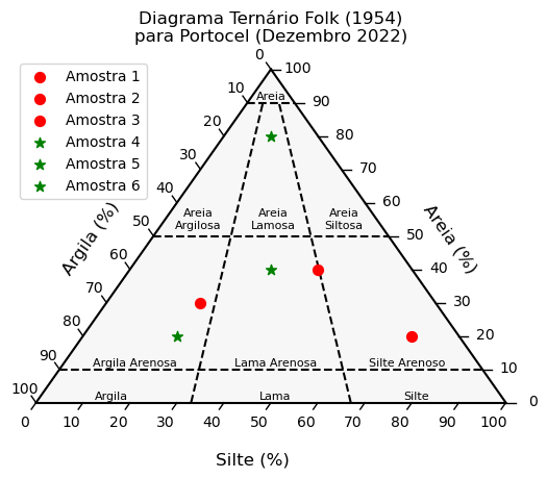
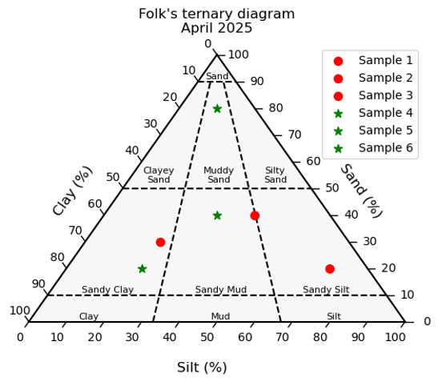

# Diagrama Ternário para Sedimentos de Folk / Folk's Ternary Grain-size Diagram
## Reference: Folk, R. L. The distinction between grain size and mineral composition in sedimentary-rock nomenclature. The Journal of Geology, Vol. 62, No. 4 (Jul., 1954), pp. 344-359

